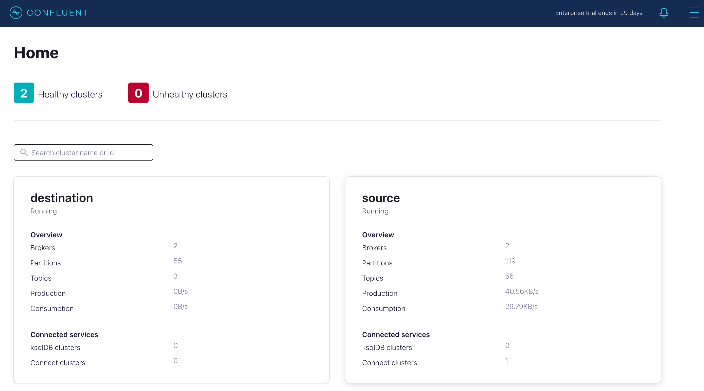
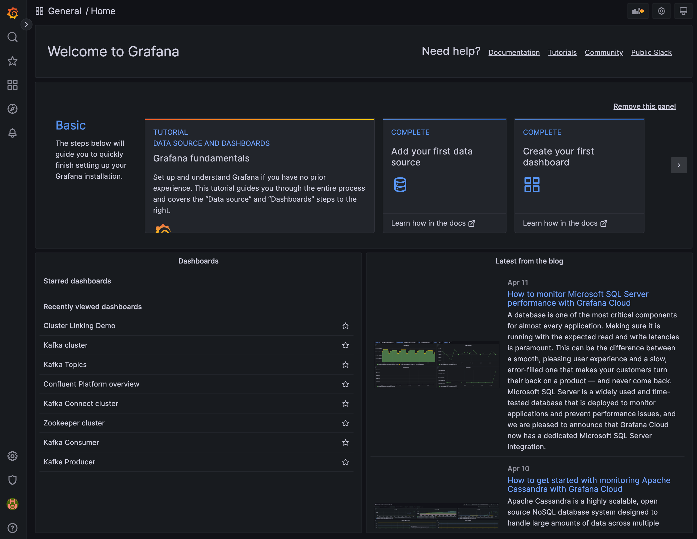
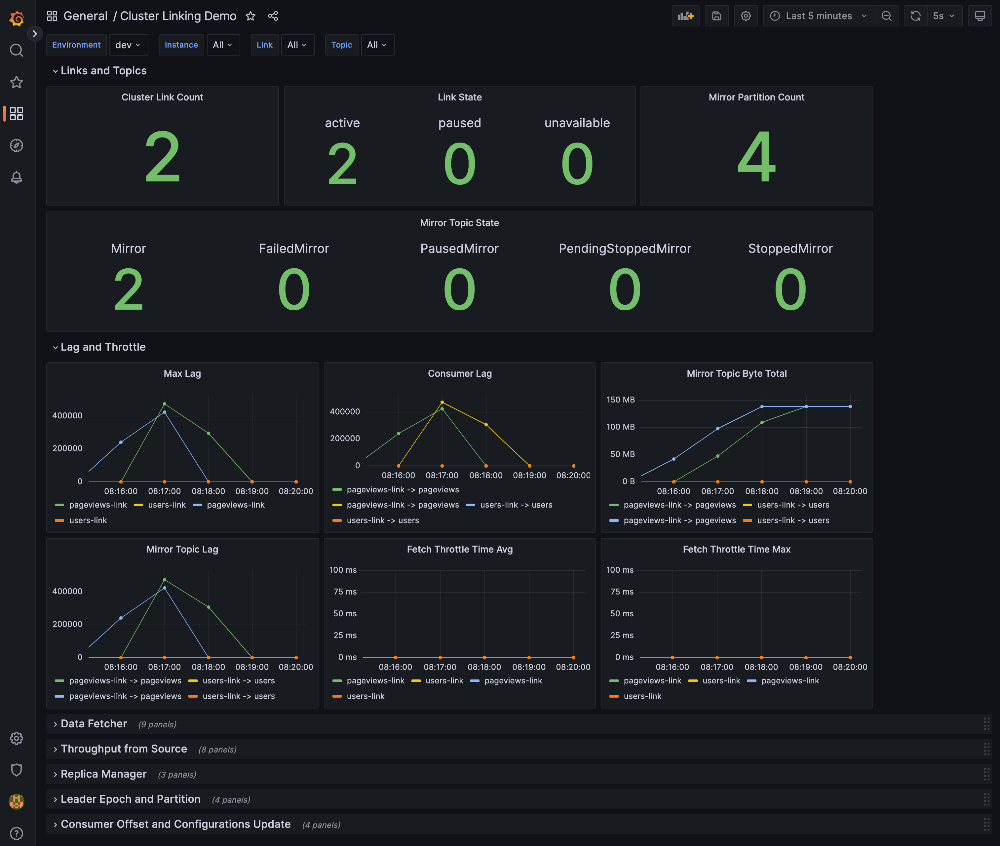

# Overview
The following diagram depicts the overall architecture of this demo envrionment.

- There are two Kafka clusters running, namely source and destination cluster. Each cluster consists of a single zookeeper and two confluent servers.
- They are sharing the same schema registry.
- A single Control Center is used to manage and monitor both clusters, source cluster is used as for control center topics.
- A single node Connect cluster is connected to the source kafka cluster. There are two instances of datagen connectors running, they are generating messages to pageviews and users topics respectively.
- Prometheus is used to collect the JMX metrics from confluent servers.
- Grafana is used to visualize the collected metrics.

## Getting Started

1. Execute the script "runme_once.sh", it will download "jmx-monitoring-stacks" repo to your local directory and copy over the customized config files.

```
% ./runme_once.sh 
>>> Download jmx-monitoring-stacks..
Cloning into 'jmx-monitoring-stacks'...
remote: Enumerating objects: 1476, done.
remote: Counting objects: 100% (363/363), done.
remote: Compressing objects: 100% (123/123), done.
remote: Total 1476 (delta 272), reused 285 (delta 234), pack-reused 1113
Receiving objects: 100% (1476/1476), 6.24 MiB | 8.93 MiB/s, done.
Resolving deltas: 100% (717/717), done.
>>> copying files to jmx-monitoring-stacks...
>>> done
```

This step only have to be run once.

2. Execute the script "start.sh" to start the environment.

```
% ./start.sh 
-------------------------------------------
Run cluster origin and destination
-------------------------------------------
[+] Running 13/13
 ⠿ Network cluster-linking-monitoring_default  Created                                                 0.0s
 ⠿ Container grafana                           Started                                                 1.1s
 ⠿ Container prometheus                        Started                                                 1.2s
 ⠿ Container node-exporter                     Started                                                 0.9s
 ⠿ Container zookeeper                         Started                                                 1.0s
 ⠿ Container zookeeper-destination             Started                                                 1.0s
 ⠿ Container broker-destination-1              Started                                                 1.7s
 ⠿ Container broker-destination-2              Started                                                 1.6s
 ⠿ Container broker-2                          Started                                                 1.4s
 ⠿ Container broker-1                          Started                                                 1.5s
 ⠿ Container schema-registry                   Started                                                 2.0s
 ⠿ Container connect                           Started                                                 2.5s
 ⠿ Container control-center                    Started                                                 3.0s
-------------------------------------------
------------------------------------------------
wait for connect to start...
------------------------------------------------
Create topic pageviews on source cluster
-------------------------------------------
Created topic pageviews.
------------------------------------------------
Create pageviews datagen on source cluster
-------------------------------------------
HTTP/1.1 201 Created
Date: Wed, 12 Apr 2023 10:08:19 GMT
Location: http://localhost:8083/connectors/datagen-pageviews
Content-Type: application/json
Content-Length: 345

{"name":"datagen-pageviews","config":{"connector.class":"io.confluent.kafka.connect.datagen.DatagenConnector","kafka.topic":"pageviews","key.converter":"org.apache.kafka.connect.storage.StringConverter","quickstart":"PAGEVIEWS","tasks.max":"1","max.interval":"1000","_iterations":"1000000","name":"datagen-pageviews"},"tasks":[],"type":"source"}------------------------------------------------
------------------------------------------------
generating some data on pageviews...
------------------------------------------------
------------------------------------------------
Create clusterlink pageviews-link 
-------------------------------------------
Cluster link 'pageviews-link' creation successfully completed.
-------------------------------------------
------------------------------------------------
Create mirror topic pageviews
-------------------------------------------
Created topic pageviews.
-------------------------------------------
Create topic users on source cluster
-------------------------------------------
Created topic users.
------------------------------------------------
Create users datagen on source cluster
-------------------------------------------
HTTP/1.1 201 Created
Date: Wed, 12 Apr 2023 10:08:27 GMT
Location: http://localhost:8083/connectors/datagen-users
Content-Type: application/json
Content-Length: 305

{"name":"datagen-users","config":{"connector.class":"io.confluent.kafka.connect.datagen.DatagenConnector","kafka.topic":"users","key.converter":"org.apache.kafka.connect.storage.StringConverter","quickstart":"USERS","tasks.max":"1","max.interval":"2000","name":"datagen-users"},"tasks":[],"type":"source"}------------------------------------------------
------------------------------------------------
generating some data on users...
------------------------------------------------
------------------------------------------------
Create clusterlink users-link 
-------------------------------------------
Cluster link 'users-link' creation successfully completed.
-------------------------------------------
------------------------------------------------
Create mirror topic users
-------------------------------------------
Created topic users.
-------------------------------------------
```
3. Access Control Center from "http://localhost:9021"

4. Access Grafana from "http://localhost:3000" (admin/password)

5. Open the dashboard on Grafana called "Cluster Linking Demo"

6. Execute the script "stop.sh" to stop the environment
```
% ./stop.sh 

Teardown
[+] Running 13/12
 ⠿ Container control-center                    Removed                                                                                     2.5s
 ⠿ Container grafana                           Removed                                                                                     0.9s
 ⠿ Container prometheus                        Removed                                                                                     0.8s
 ⠿ Container node-exporter                     Removed                                                                                     0.7s
 ⠿ Container broker-destination-2              Removed                                                                                    10.7s
 ⠿ Container connect                           Removed                                                                                     3.3s
 ⠿ Container broker-destination-1              Removed                                                                                     3.3s
 ⠿ Container schema-registry                   Removed                                                                                     1.3s
 ⠿ Container broker-1                          Removed                                                                                     2.4s
 ⠿ Container broker-2                          Removed                                                                                    10.9s
 ⠿ Container zookeeper-destination             Removed                                                                                     0.6s
 ⠿ Container zookeeper                         Removed                                                                                     0.6s
 ⠿ Network cluster-linking-monitoring_default  Removed
```

## Things to Try

Here are some scenario you can try to observe the behavior of a cluster link.

### 1. Update the connector config to generate higher workload
### 2. Apply a quota on source cluster
### 3. Bring down a confluent server on destination cluster
### 4. Bring down a confluent server on source cluster
### 5. Start a client application to consume messages from source cluster